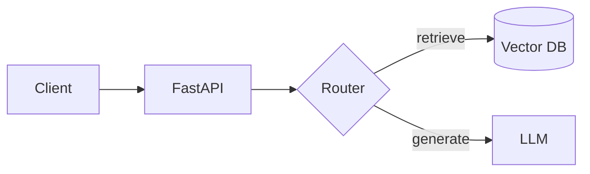

# 🏛️ Architecture Notes

Architecture and design-decision notes for the systems built across milestones, plus reusable
patterns. Diagrams live alongside their notes (Mermaid preferred so they render on GitHub).

## Index

| Note | Milestone | Status |
|------|:---------:|:------:|
| Provider-agnostic LLM client design | M1 | ⚪ |
| RAG pipeline architecture | M2 | ⚪ |
| Agent system anatomy (orchestrator/tools/memory/guardrails/observability) | M3 | ⚪ |
| Eval + CI ship-gate architecture | M4 | ⚪ |
| Serving & deployment topology | M5 | ⚪ |
| Capstone end-to-end architecture | M6 | ⚪ |

## Mermaid diagram template

